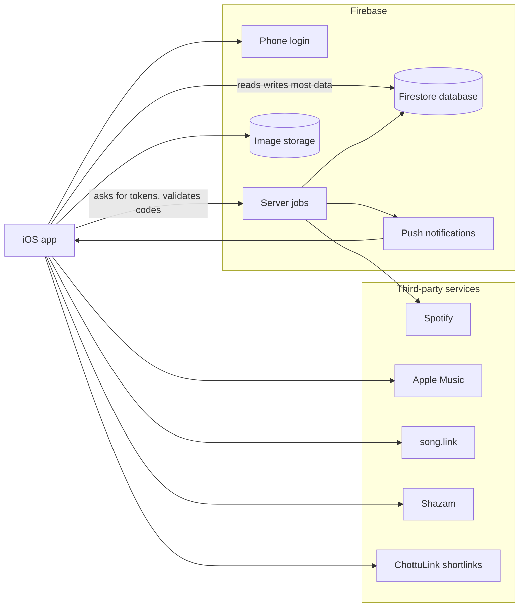
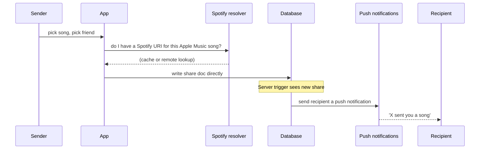
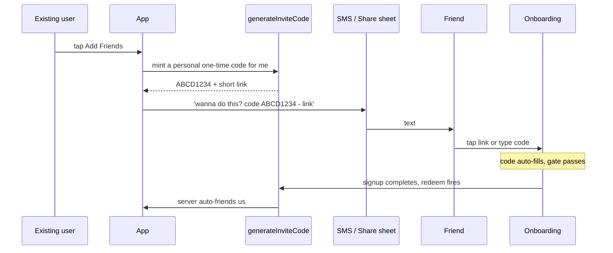
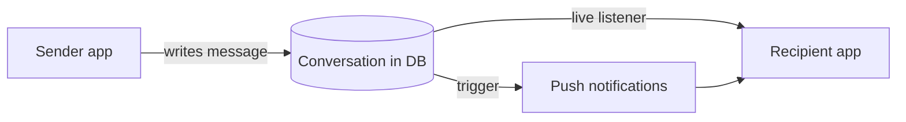
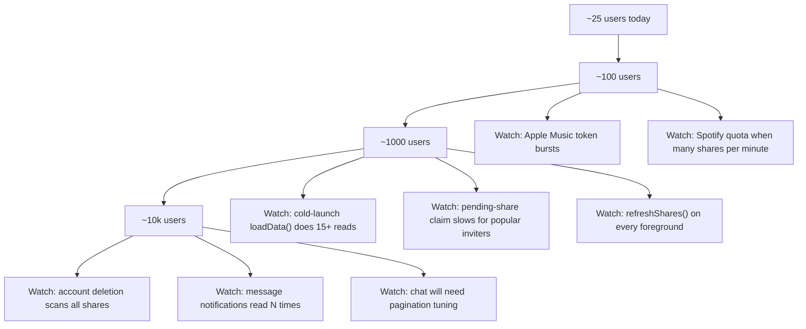

# RIFF — Architecture Mental Model

> **Audience:** Product owner / founder. Not a technical spec.
> **Goal:** Give you a clear, plain-language map of every moving part, the user flows that tie them together, and the specific places where security or scalability could trip you up.
> **Generated:** May 20, 2026
> **Source state:** `main` branch at `f46bf93` (Phase B invite-code system shipped; security hardening shipped; deploy + scripts merged).

---

## How to use this document

- **Skim once top to bottom** to build the mental model.
- The Mermaid diagrams render automatically in GitHub, Cursor, VS Code, Obsidian, and most modern Markdown viewers.
- **To export as PDF:** open in Cursor or VS Code → right-click the file → *Markdown: Open Preview* → use the browser/system *Print → Save as PDF*. (Or run `npx @marp-team/marp-cli architecture-mental-model.md --pdf` from the repo root.)
- Sections are independent — feel free to jump to the **Risk maps** at the bottom if you want the security/scalability digest first.

---

## Table of contents

1. [The 60-second tour](#the-60-second-tour)
2. [The big picture](#the-big-picture)
3. [Plain-language glossary](#plain-language-glossary)
4. [Key user flows](#key-user-flows)
   - [Signup](#signup-the-most-security-sensitive-flow)
   - [Sending a song](#sending-a-song-the-core-product-loop)
   - [Invite + claim](#how-an-invite--claim-works)
   - [Real-time chat](#how-real-time-chat-works)
5. [The data warehouse](#the-data-warehouse--what-lives-where)
6. [Security risk map](#security-risk-map-in-plain-language)
7. [Scalability risk map](#scalability-risk-map-in-plain-language)
8. [Quick wins available now](#what-you-can-do-right-now-that-pays-off-quickly)
9. [What this is built for (and not)](#what-the-architecture-is-built-for-and-not)
10. [Appendix: where to look in the codebase](#appendix-where-to-look-in-the-codebase)

---

## The 60-second tour

RIFF is a **client-heavy** iOS app sitting on top of **Firebase** (Google's "everything in a box" backend). The phone talks **directly to the database** (Firestore) for almost everything — sending songs, reading the feed, chatting. A small set of **server-side jobs** (Cloud Functions) only handle the things the phone is not allowed to do or shouldn't do: send push notifications, mint Apple Music tokens, validate invite codes, and clean up when accounts are deleted.

The biggest implication, both good and bad: **the database's rule file is your wall.** If a write makes it past those rules, it's in. There's no API server between the phone and your data.

---

## The big picture



**Read this as:** the phone is the prime mover. Everything else is a service it calls. The server jobs are reinforcements, not gatekeepers.

---

## Plain-language glossary

| Tech term | What it means here |
|-----------|---------------------|
| **Firestore** | The database. Stores users, songs, friends, messages. |
| **Cloud Function** | A small program that runs on Google's servers when triggered (HTTP call, database change, daily timer). |
| **Firestore rules** | The wall between any signed-in phone and the database. Decides which writes are accepted. |
| **ID token / Bearer token** | A short-lived "login proof" the app shows when calling server jobs. |
| **FCM / APNs** | The plumbing that delivers push notifications. |
| **Trigger** | A server job that fires automatically when something specific happens in the database. |
| **Rate limiter** | An abuse-prevention throttle: "no more than N of these per minute." |
| **Fan-out write** | When one event causes the system to write to many places at once (sending a song writes a share doc, a conversation doc, a message doc, a notification, etc.). |

---

## Key user flows

### Signup — the most security-sensitive flow

```mermaid
sequenceDiagram
  participant U as New user
  participant App
  participant V as validateInviteCode
  participant FA as Firebase phone login
  participant DB as Database
  participant R as redeemInviteCode
  participant Claim as Pending-share claim

  U->>App: opens app, types code (or tapped link)
  App->>V: is this code valid?
  V-->>App: yes (kind=creator|personal|admin)
  U->>FA: enter phone, get SMS code, confirm
  FA-->>App: logged in (uid + token)
  App->>DB: create my profile, claim my username
  App->>R: redeem my code with my token
  R->>DB: stamp who invited me; maybe auto-friend them
  Note over DB,Claim: A separate trigger sees my profile created and<br/>delivers any songs friends queued for my phone
```

**Why it matters:**

- **The gate** (`validateInviteCode`) is the only public-facing door without a login. It's protected by an IP throttle (20 attempts per IP per 10 min). A determined attacker with rotating IPs can still probe codes, but each code has ~30 billion possibilities, so guessing is impractical.
- **Phone numbers in Firebase Auth and your `users.phone` field are not the same source of truth.** This is the gotcha behind the `@bobby` / `@may` confusion from May 2026: deleting a Firestore profile doesn't free up the phone in Authentication, and vice versa. Sign-in always follows **Authentication**, not the database row.
- **Pending shares** (songs sent to a phone *before* the recipient signed up) get auto-delivered when their profile is created. Good UX, but it's a server-side fan-out that scales with the number of queued songs for that phone — see scalability risks below.

### Sending a song — the core product loop



**Why it matters:**

- **The phone writes the share doc directly.** The server doesn't validate the content — it only reacts. The database rules are what stop one user from forging a share *as* another user.
- **Spotify resolution** is a 5-tier cache: in-memory → on-device → shared global cache → server lookup → song.link fallback. This makes the "Open in Spotify" button feel instant, but it also means **whatever Spotify match the first viewer of a song stores in the shared cache, every later viewer trusts.** If a bad match gets cached, it's sticky.
- **Push notifications use a 24-hour dedupe** so you don't double-notify if a share is rewritten. The dedupe is per-message-key in the database.

### How an invite + claim works



**Why it matters:**

- **Codes are single-use for personal invites, multi-use for creator codes** like `J7CJBGV3` (your current launch code).
- The "auto-friend" only happens for **personal** invites. Your creator code is **attribution-only** — it tags new signups as yours but does not friend them.
- The minting endpoint is throttled at **10 codes per user per day** — generous for the share flow, brutal for abuse.

### How real-time chat works



Each conversation is a database doc with messages underneath. When one phone writes a message, the database **pushes the change to anyone listening** to that conversation in real time. The phone you're sending to gets the message before a notification ever fires; the notification is just a wake-up if the app is closed.

The chat UI itself is a recent rebuild: the bubbles are still SwiftUI, but they live inside a UIKit collection view to get the rock-solid "stick to bottom" feel iMessage has. Functionally invisible to users, structurally important if you ever want group chats — that's where the current chat architecture would start to creak.

---

## The data warehouse — what lives where

Think of Firestore as a filing cabinet. These are the drawers.

| Drawer | What's inside | Who can read | Who can write |
|--------|---------------|--------------|---------------|
| **`users`** | Public profile, taste, friend count | Any signed-in user | Owner only (specific fields) |
| **`users/.../private/profile`** | Phone, push token | Owner | Owner |
| **`users/.../friends`** | Friend rows (mirrored on both sides) | Owner | Owner + friend |
| **`shares`** | Every song share, ever | Sender + recipient | Sender on create |
| **`conversations`** | DM rooms | Participants | Participants (restricted fields) |
| **`messages`** | Chat messages, reactions | Participants | Participants |
| **`pendingShares`** | Songs queued for unregistered phones | Server only | Sender |
| **`inviteCodes`** | The invite system | **Server only** | **Server only** |
| **`usernames`** | Reservations on `@handles` | Anyone signed in | Owner on first claim |
| **`spotifyResolutions`** | Shared "Apple Music URL → Spotify URI" cache | Anyone signed in | Server only |
| **`featured_songs`, `featured_mixtapes`** | Editorial Discover feed | **Public** (no login) | Admin only |
| **`pushDedupe`, `rateLimits`** | Bookkeeping | Server only | Server only |
| **`reports`** | User-submitted reports | Server only | Anyone (one per report) |

**Two things to internalize:**

1. **Public profiles**: anyone signed in can read any user's public profile. That's required for username search. Don't put anything sensitive on it. (Phone is the borderline case — it's still listed as a client-writable field on the public doc, which is a known minor flag.)
2. **Featured content is world-readable.** Useful for unauthenticated landing pages and SEO, risky if you ever store anything in there you don't want copied/scraped.

---

## Security risk map (in plain language)

Sorted by likelihood × impact. Severity columns assume your current ~25-user scale; some get worse as you grow.

### High — should be on your radar

| # | Concern | What can go wrong | How exposed are we today |
|---|---------|-------------------|--------------------------|
| 1 | **The shared Spotify-resolution cache trusts whoever fills it first** | If the first viewer of a song picks the wrong Spotify match, every later viewer opens the wrong song. | Cache writes are now server-only (we hardened this), but **the server itself trusts whatever Spotify's search API returns** — a bad search result becomes permanent until cleared. |
| 2 | **Public profiles include phone as a write-allowed field** | A malicious client could rewrite their own phone to something else and (worst case) intercept pending-share fan-out destined for someone else. | Phone is still in the client-write allowlist. Should be moved to the private profile subcollection so the public doc is name+username+taste only. |
| 3 | **Invite-code probing on the unauthenticated endpoint** | 20-per-IP throttle is good but not perfect. With many IPs, you can fish for codes. | Tolerable today because codes have huge keyspace and SMS verification gates real signup. Add per-code probe count if you see attacks. |
| 4 | **No "App Check"** | Anyone with a valid login token can call your server jobs from a script (not just from the iOS app). Most likely abuse: scripted signups burning your Spotify quota. | Deferred. Would cap any abuse to real iOS devices. Worth turning on before you have visible scale. |
| 5 | **Rate limiters fail open** | If Firestore is briefly unhealthy, our throttles let everything through rather than blocking everything. | A trade-off — better availability, worse during an attack that coincides with an outage. |

### Medium — worth fixing, not urgent

| # | Concern | What can go wrong |
|---|---------|-------------------|
| 6 | **`onUserProfileCreated` trusts the phone on the public doc to find pending shares** | If a client wrote a wrong phone, queued songs from that phone go to the wrong account. Fix is tied to #2 — once phone is server-only, this closes. |
| 7 | **Deprecated Spotify endpoints (`/swap`, `/auth`, etc.) still deployed** | They return 410 Gone, but they're still endpoints. Attack surface for log noise and confused tooling. |
| 8 | **Push dedupe fails open** | A rare Firestore error during the dedupe transaction means a duplicate push. Mostly annoying, not dangerous. |
| 9 | **ChottuLink API key shipped in the app** | The key lives in `Config.plist` (gitignored, not in repo) but is in the compiled binary. Standard for mobile SDKs; rotate if you ever suspect a leak. |
| 10 | **Reports collection has no moderation surface** | Users can file reports but no one reads them. Need an admin console or at least daily email digest. |

### Low — file under "good hygiene"

- The Node.js runtime your server jobs use is on a deprecation timer (decommission late 2026).
- The `firebase-functions` package is behind the latest. Both are upgrade-by-October items.

---

## Scalability risk map (in plain language)

The system is comfortable to roughly **1,000–5,000 users** as is. The bottlenecks past that point aren't the database itself (Firestore is fine at this scale) but specific app-and-server patterns.



### What slows down as you grow

| Stage | What starts to creak | Why | What to do |
|------|----------------------|-----|------------|
| **~500 users** | Cold-launch feels slower | Every signed-in launch fires 15+ database reads and 7 live listeners. None are huge, but they pile up. | Tier the loads — fetch the active tab first, defer the rest by 500ms. |
| **~500 users** | Foreground refresh feels heavy | We refetch all share types + saves + mixtapes every time you reopen the app. | Use the live listeners as the source of truth; drop the redundant refreshes. |
| **~1,000 users** | Spotify API hiccups | Server-side Spotify lookups share a ~180 req/min quota app-wide. Heavy share moments could 429. | Already mitigated by the resolution cache, but pre-warm common resolutions and consider a paid Spotify tier. |
| **~1,000 users** | Popular inviters cause slow onboarding | When a popular user's friend signs up, the server has to fan out **every queued song** before signup completes. | Batch the fan-out asynchronously — finish signup first, deliver in the background. |
| **~5,000 users** | Account deletion can timeout | Deleting an account scans every share you sent or received. A user with thousands of shares could time out. | Paginate the cascade or run it in chunks via a separate job. |
| **~5,000 users** | If you ever do group chats | The notification trigger reads the database once per recipient. Fine for DMs; explodes for groups. | Today, DM-only is safe. Don't add group chat without redesigning that trigger. |
| **~10,000 users** | Daily push-dedupe cleanup might exceed its time budget | The 24-hour sweeper processes up to 10,000 entries per run. Past that, it falls behind. | Bump the per-run cap or schedule it every 6 hours. |

---

## What you can do right now that pays off quickly

1. **Move `phone` off the public profile** into the private subcollection — closes risks #2 and #6.
2. **Turn on App Check** — closes most "scripted abuse" risk, takes a couple hours.
3. **Add a cap on probes per individual invite code** (e.g. 5 misses per code per hour) — defense in depth on the gate.
4. **Defer non-critical loads on cold launch** — biggest single perceived-speed win as you grow.
5. **Tier `refreshShares` to only run if more than 30s passed since last refresh** — cuts unnecessary reads on rapid app switches.

Each of these is a few hundred lines of work at most. None require schema migrations.

---

## What the architecture is built for (and not)

**Built for:**

- Sharing songs 1-to-1 with friends
- A small, real-time social graph (max 20 friends per user today)
- Editorial discovery that one person curates (you)
- Phone-based identity, no email/password
- Apple Music as the source of truth, Spotify as the handoff

**Not built for (yet):**

- Group chats or multi-recipient sends
- Public posting / followers
- Anonymous lurkers who don't sign in
- Web clients (only iOS today)
- Music libraries that aren't Apple's catalog

If any of those land on the roadmap, the cleanest move is to think about them before the user base gets big enough that schema migrations hurt — which, given the current trajectory, leaves a comfortable window.

---

## Appendix: where to look in the codebase

For each section above, the actual code lives here:

| Concept | Files |
|---------|-------|
| **All server jobs** | `functions/index.js` |
| **Database rules (the wall)** | `firestore.rules` |
| **App entry / push setup** | `ios/PlayMe/PlayMeApp.swift` |
| **Global state** | `ios/PlayMe/ViewModels/AppState.swift` |
| **Database client (reads/writes)** | `ios/PlayMe/Services/FirebaseService.swift` |
| **Audio preview playback** | `ios/PlayMe/Services/AudioPlayerService.swift` |
| **Apple Music search** | `ios/PlayMe/Services/AppleMusicSearchService.swift` |
| **Spotify resolution chain** | `ios/PlayMe/Services/MusicSearchService.swift` |
| **Shazam fingerprinting** | `ios/PlayMe/Services/ShazamMatchService.swift` |
| **Deep links & invite codes** | `ios/PlayMe/Services/DeepLinkService.swift` |
| **Onboarding orchestrator** | `ios/PlayMe/Views/OnboardingView.swift` |
| **Chat (UIKit-backed)** | `ios/PlayMe/Views/ChatView.swift`, `ios/PlayMe/Views/Chat/ChatMessagesCollectionView.swift` |
| **Discovery feed** | `ios/PlayMe/Views/Discovery/DiscoveryView.swift` |
| **Settings** | `ios/PlayMe/Views/Settings/SettingsView.swift` |
| **Security hardening notes** | `SECURITY.md` |
| **Ops scripts** (invite minting, friend-count backfill, orphan cleanup) | `functions/scripts/` |

---

*Document maintained as part of the repo. To update, edit `docs/architecture-mental-model.md` and commit. The Mermaid diagrams are rendered at view time by GitHub / Cursor / VS Code, so the file stays a single source of truth — no image assets to drift out of sync.*
